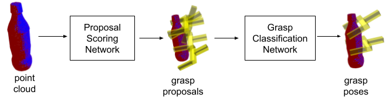
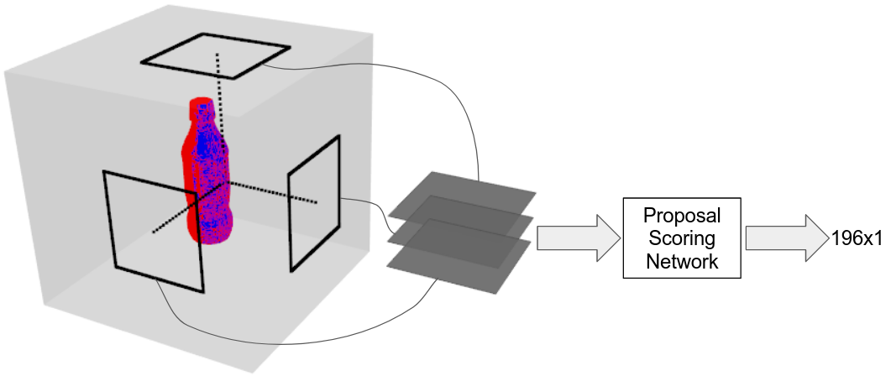
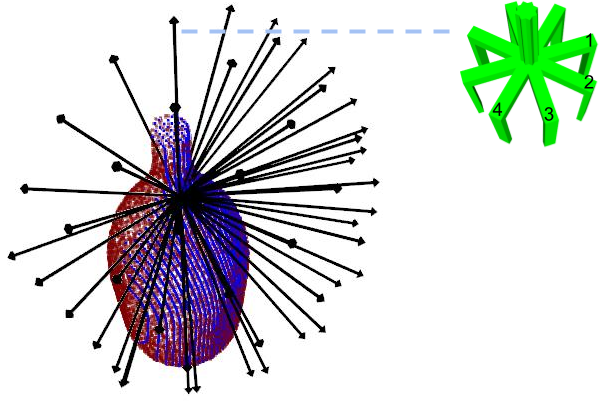

# Efficient and Accurate Candidate Generation for Grasp Pose Detection in SE(3)

abc

## Summary

Grasp detection of novel objects in unstructured environments is a key
capability in robotic manipulation. For 2D grasp detection problems where
grasps are assumed to lie in the plane, it is common to design a fully
convolutional neural network that predicts grasps over an entire image in one
step. However, this is not possible for grasp pose detection where grasp poses
are assumed to exist in SE(3). In this case, it is common to approach the
problem in two steps: grasp candidate generation and candidate classification.
Since grasp candidate classification is typically expensive, the problem
becomes one of efficiently identifying high quality candidate grasps. This
paper proposes a new grasp candidate generation method that significantly
outperforms major 3D grasp detection baselines.

### System Diagram

Our method takes as input a 3D point cloud and outputs 6-DOF grasp poses in
SE(3). It has two components: the Proposal Scoring Network (PSN) and the Grasp
Classification Network (GCN). The PSN evaluates a large set of grasp candidates
quickly, while the GSN makes a high quality binary prediction about each
candidate. 

### Proposal Scoring Network

### Grasp Candidates

Our method samples *n* points from the point cloud and considers *m=196* robot
hand orientations for each of the *n* points. Above, each black arrow
corresponds to one of 49 hand approach directions. For each approach direction,
there are four possible rotations about the approach axis (green).

## Publication

[Andreas ten Pas](http://ccs.neu.edu/home/atp/), [Colin
Keil](https://www.khoury.northeastern.edu/people/colin-keil/), and [Robert
Platt](http://ccs.neu.edu/home/rplatt/). Efficient and Accurate Candidate
Generation for Grasp Pose Detection in SE(3). IEEE/RSJ International Conference
on Intelligent Robots and Systems (IROS), 2021.

## Video

Coming soon.

### Source Code

Coming soon.
